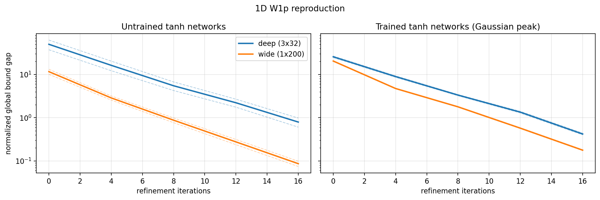
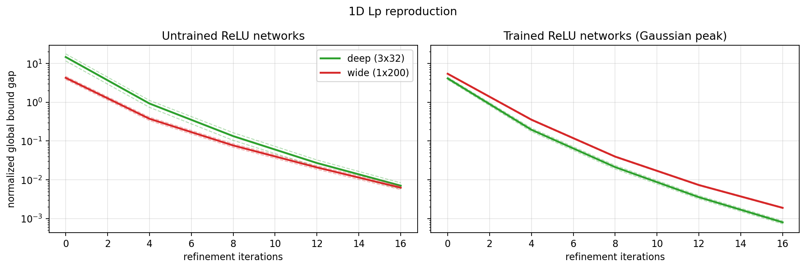
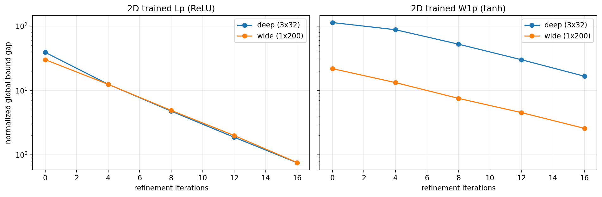
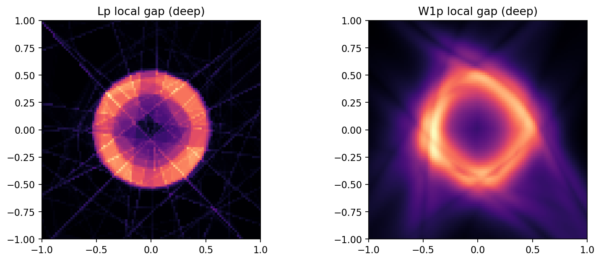

# intervalNets

`intervalNets` is a robust PyTorch-first toolkit focused on three core capabilities:

1. an overloaded `model.eval(interval)` pathway (enabled via `enable_interval_eval(...)`) for interval
   propagation through neural networks with outward-rounded arithmetic, including roundoff-aware bounds;
2. rigorous enclosure of Lebesgue/Lp norms over interval domains via `model.lpnorm(domain, p, iterations=...)`;
3. interval Jacobian enclosure via `model.eval_jacobian(domain)` and Sobolev-style norms via
   `model.sobolev_norm(domain, p, iterations=...)`.
   The current implementation follows the same interval-enclosure + adaptive-refinement strategy outlined in
   the preprint *Certified and accurate computation of function space norms of deep neural networks*
   (arXiv:2603.06431).

## Design note: speed-oriented interval enclosures

The current implementation uses a **midpoint-radius interval representation** and is explicitly
optimized for repeated affine propagation of interval vectors through matrices:

\[
A x_{\text{mid}} \pm |A| x_{\text{rad}}.
\]

This design gives fast, vectorized propagation for neural network workloads (especially `nn.Linear`
and Jacobian composition). The resulting boxes are **conservative enclosures**, but they are not
always the tightest possible interval enclosure one could compute with more expensive methods.

## Highlights

- interval construction and arithmetic operations use outward rounding to account for floating-point roundoff errors,
- degenerate intervals `[x, x]` are supported,
- interval propagation currently supports `nn.Sequential`, `nn.Flatten`, `nn.Linear`, `nn.ReLU`, `nn.Sigmoid`, `nn.Tanh`, `nn.Softplus`, `nn.LeakyReLU`, `nn.Softmax`, `nn.Identity`, plus `IntervalAdd`/`IntervalCat` branch combinators,
- ReLU propagation preserves mathematically exact zero images (`[0, 0]`) for non-positive pre-activation intervals; only non-exact branches are outward-padded,
- linear and Jacobian propagation are implemented with midpoint-radius matrix formulas for speed; this favors runtime performance over globally minimal box tightness,
- `model.eval(interval)`, `model.eval_jacobian(...)`, `model.lpnorm(...)`, and `model.sobolev_norm(...)` are attached through a single opt-in monkey patch (`enable_interval_eval()`), and the selected `enclosure_mode` is reused for both `model.eval(interval)` and sequential pre-activation propagation inside `model.eval_jacobian(...)`,
- `enable_interval_eval(enclosure_mode="slope")` accepts `"box"` or `"slope"` (default: slope-aware affine relaxation for `nn.Sequential` chains of `nn.Linear` + `nn.ReLU`, with conservative fallback to `"box"` for unsupported layers),
- slope mode is particularly useful for dependency-heavy patterns such as `Linear(rotation) -> ReLU -> Linear(rotation^{-1})`: plain box propagation can overestimate strongly, while slope-aware relaxations keep substantially tighter certified bounds,
- for additional tightness, `interval_forward_refine(model, interval, enclosure_mode="slope", splits_per_dim=...)` subdivides the input box and hulls sub-box outputs (higher cost, tighter bounds),
- `model.lpnorm(domain, p, iterations, theta=0.5)` and
  `model.sobolev_norm(domain, p, iterations, theta=0.5)` use
  Dörfler-type bulk marking (with uncertainty indicators) and adaptive
  bisection to return outward-rounded certified norm enclosures; rigorously constant boxes with zero Jacobian are skipped during Sobolev refinement.
- both norm routines accept optional `forward_refine_splits` / `forward_refine_max_cells` arguments to tighten per-box forward enclosures during integration.

## Quick start

### Option 1: install the package into your environment

From the repository root (either approach works):

```bash
# Option A: install dependencies directly
pip install -r requirements.txt

# Option B: install the package in editable mode
pip install -e .
```

Then you can import it normally:

```python
from intervalnets import IntervalTensor, enable_interval_eval
from torch import nn

enable_interval_eval(enclosure_mode="slope")

model = nn.Sequential(nn.Linear(2, 1))
interval = IntervalTensor.from_bounds([1.0, 2.0], [1.5, 2.5])
output = model.eval(interval)

# optional tighter forward enclosures for Linear+ReLU chains
enable_interval_eval(enclosure_mode="slope")

domain = IntervalTensor.from_bounds([0.0, 0.0], [1.0, 1.0])
lp_bounds = model.lpnorm(domain, p=2.0, iterations=8)
w1p_bounds = model.sobolev_norm(domain, p=2.0, iterations=8)
```

### Option 2: run directly from the repo without installing

If you are in a notebook or script inside the repository, add `src/` to `sys.path` first:

```python
import sys
from pathlib import Path

repo_root = Path.cwd().resolve()
while not (repo_root / "src" / "intervalnets").exists() and repo_root != repo_root.parent:
    repo_root = repo_root.parent
sys.path.insert(0, str(repo_root / "src"))
```

After that, `from intervalnets import ...` will work from the checkout as well.

## Installation notes

- the core `Interval` type uses only the Python standard library,
- PyTorch integration is optional and requires installing PyTorch separately,
- the included notebook now auto-detects the repo root and adds `src/` to `sys.path` for convenience.

For worked examples, see:

- `notebooks/test_suite.ipynb` for quick feature checks and sanity tests,
- `notebooks/reproduce_lp_w1p_experiments.ipynb` for reproducible certified
  `L^p` and `W^{1,p}` experiments aligned with arXiv:2603.06431 (intentionally excluding `W^{2,p}`).


## Numerical experiment figures

The notebook pipeline now exports figures under
`notebooks/notebooks/artifacts/`, and they can be embedded directly in this
README.

### 1D toy experiments (`L^p` and `W^{1,p}`)




### 2D experiment diagnostics




## Reference

- Johannes Gründler, Moritz Maibaum, Philipp Petersen,
  *Certified and accurate computation of function space norms of deep neural networks*,
  arXiv:2603.06431 (2026). https://arxiv.org/abs/2603.06431

## Authors and acknowledgements

`intervalNets` was created by **Moritz Maibaum** and **Philipp Petersen**, with development support from **OpenAI Codex**.
